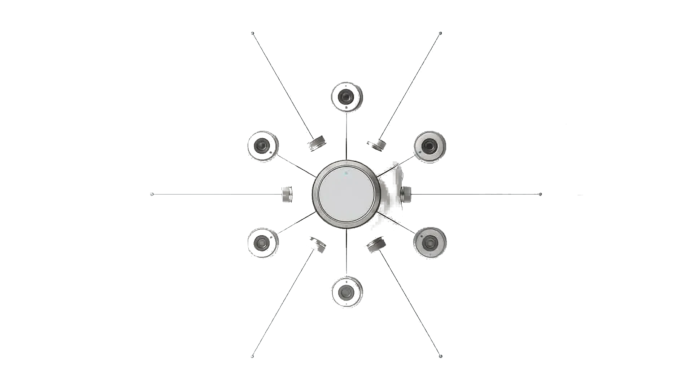
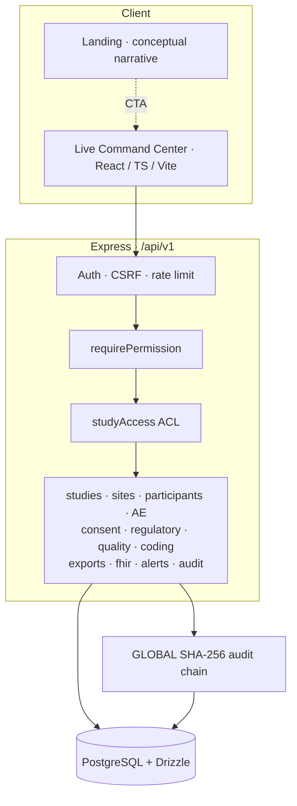
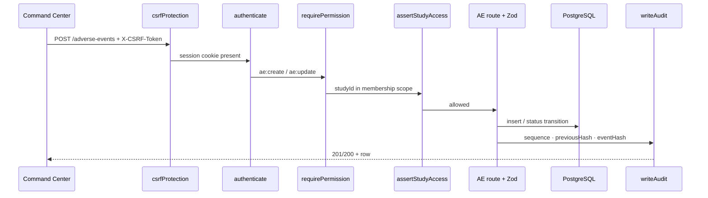
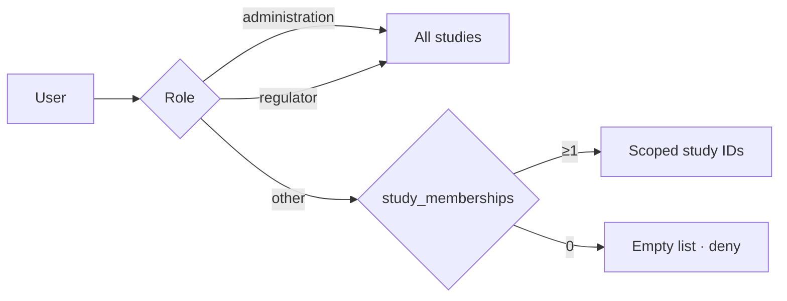

# VEDRAYA

**An auditable, role-based Clinical Trial Management System for Ayurveda research operations.**

SIH26046 · Ministry of Ayush / AIIA · Working CTMS **prototype** (not a certified production system)

[](./tsconfig.json)
[](./package.json)
[](./server)
[](./server/package.json)
[](./playwright.config.ts)
[](./docs/SIH26046_TRACEABILITY_FINAL.md)
[](./docs/LIMITATIONS.md)

| Resource | Link |
|----------|------|
| Repository | [github.com/nishant-uxs/vedraya](https://github.com/nishant-uxs/vedraya) |
| Frontend deploy | [vedraya-three.vercel.app](https://vedraya-three.vercel.app) *(SPA only — API + Postgres run separately)* |
| Judge script | [`docs/DEMO_SCRIPT.md`](./docs/DEMO_SCRIPT.md) |
| Judge Q&A | [`docs/JUDGE_QA.md`](./docs/JUDGE_QA.md) |

<p align="center">
  
</p>

<p align="center"><sub>Cinematic landing identity · operational truth lives in <b>Live Command Center</b> (PostgreSQL-backed)</sub></p>

---

## Overview

VEDRAYA consolidates clinical research operations into a single demoable stack:

| Area | Capabilities |
|------|----------------|
| **Operations** | Studies, sites, investigators, participants, milestones, enrolment KPIs |
| **Safety** | AE/SAE workflow, reporting timeline tracking, MedDRA/WHODrug-**compatible DEMO** coding |
| **Governance** | Consent, ethics, regulatory / **CTRI TRACKING**, quality deviations & data queries |
| **Security** | Session auth, 7-role RBAC, study membership ACL, CSRF, rate limiting |
| **Integrity** | Append-only audit + GLOBAL SHA-256 hash-chain verification |
| **Interop** | FHIR R4 ResearchStudy/Subject **prototype**, SDTM-like AE export, CSV |

Marketing sections above the Command Center are **conceptual narrative**. Live numbers come from PostgreSQL after sign-in.

---

## Judge in 60 seconds

Prerequisite: `npm run demo:seed` · Password: `Vedraya!Demo1` · Full timing: [`docs/DEMO_SCRIPT.md`](./docs/DEMO_SCRIPT.md)

1. Open app → **Enter Live Command Center** → login `admin@vedraya.demo`
2. Confirm badge **Command Center · Live PostgreSQL**
3. Open study **AYU-024** → Sites · Investigators · Participants
4. **Safety** → open AE → DEMO MedDRA coding → escalate SAE → reporting due / notify
5. **Consents** + **Regulatory** (IEC / CTRI TRACKING / NDCT) → **Quality** + alerts
6. **Audit** → **Re-verify SHA-256 chain** → `AUDIT CHAIN: VERIFIED`
7. **Exports** / **Interop** → SDTM-like AE · FHIR prototype · adapters **NOT CONNECTED**
8. Logout → `monitor@vedraya.demo` → only **AYU-024**
9. Logout → `regulator@vedraya.demo` → no create UI · API mutations **403**

---

## System status

| Layer | Status | Evidence |
|-------|--------|----------|
| Frontend (React / Vite) | **IMPLEMENTED** | `src/` · cinematic landing + Command Center |
| Backend API | **IMPLEMENTED** | `server/` Express modular monolith · `/api/v1` |
| PostgreSQL + Drizzle | **IMPLEMENTED** | migrations through `0004_phase6_quality_reporting` |
| Authentication | **IMPLEMENTED** | Argon2id · `vedraya_sid` HTTP-only cookie |
| CSRF / rate limit | **IMPLEMENTED** | double-submit CSRF · pluggable limiter |
| RBAC (7 roles) | **IMPLEMENTED** | `server/src/db/seed.ts` `ROLE_DEFS` |
| Study membership ACL | **IMPLEMENTED** | `server/src/middleware/studyAccess.ts` |
| KPIs / computed alerts | **IMPLEMENTED** | DB aggregations · rule-based alerts |
| Studies / sites / investigators / participants | **IMPLEMENTED** | CRUD + status machines |
| Consent | **IMPLEMENTED** | versions · obtain / withdraw |
| Regulatory / ethics / CTRI TRACKING | **PARTIAL** | internal tracking · no external CTRI API |
| AE/SAE + reporting timeline | **PARTIAL** | demo clocks · not jurisdiction-certified |
| Quality (deviations / queries) | **PARTIAL** | `/api/v1/quality/*` |
| MedDRA / WHODrug coding | **PROTOTYPE** | `MEDDRA_DEMO` / `WHODRUG_DEMO` |
| Audit SHA-256 chain | **IMPLEMENTED** | append-only API · verify endpoint · **not WORM** |
| SDTM-like AE / FHIR R4 | **PROTOTYPE** | `/exports/sdtm/ae` · `/fhir/R4/*` |
| ABDM / HIS / EDC | **NOT CONNECTED** | `/interop/adapters` |
| Full CDISC / Define-XML / eSign / WORM | **NOT IMPLEMENTED** | — |

Source: [`docs/IMPLEMENTATION_STATUS.md`](./docs/IMPLEMENTATION_STATUS.md)

---

## Core capabilities

### Clinical trial operations
Studies (lifecycle transitions) · sites & study-site assignment · investigators · participants (screened / enrolled) · milestones · portfolio KPIs · computed alerts (enrolment lag, overdue monitoring, open SAE, etc.)

### Safety & pharmacovigilance
AE capture · SAE escalate · classify fields · reporting due / authority notified · MedDRA-compatible **demo** coding · WHODrug-compatible **demo** concomitant meds · safety KPIs

### Compliance & governance
Informed consent versions · obtain / withdraw · ethics committees · regulatory submissions (IEC / CTRI / NDCT **tracking**) · protocol deviations · data queries · audit trail + re-verify

### Security
Cookie sessions · Argon2id · CSRF on mutations · RBAC middleware · study ACL · Helmet · Zod validation · login rate limiting

### Interoperability (honest)
FHIR R4 ResearchStudy / ResearchSubject reads · SDTM-like AE CSV · subjects CSV export · ABDM / HIS / EDC adapters explicitly **NOT CONNECTED**

---

## Architecture

Modular monolith — not microservices.



### Mutation path (example: AE create / escalate)



### Study ACL



---

## Security verification

Results from Phase 5–7 red-team / freeze tests (`server/tests/api.*.test.ts`):

| Check | Expected | Result |
|-------|----------|--------|
| Unauthenticated `GET /studies` | 401 | PASS |
| Sessioned mutation without CSRF | 403 | PASS |
| Regulator `POST /studies` | 403 | PASS |
| Monitor `GET` non-assigned study | 403 | PASS |
| Zero-membership `GET /studies` | `[]` | PASS |
| Audit `PATCH` / `DELETE` | 405 | PASS |
| Direct DB audit tamper → verify | `valid: false` | PASS |
| Post-seed audit verify | `valid: true` | PASS |

Model notes: [`docs/SECURITY.md`](./docs/SECURITY.md) · [`docs/AUDIT.md`](./docs/AUDIT.md)

---

## RBAC & study scope

| Role | Demo account | Study scope (seed) | Writes (summary) |
|------|--------------|--------------------|------------------|
| Administration | `admin@vedraya.demo` | All | Full (audit still non-mutable) |
| Regulator | `regulator@vedraya.demo` | All (read) | Blocked by RBAC |
| Principal Investigator | `pi@vedraya.demo` | AYU-024, AYU-031 | Study update · participants · AE · consent |
| Study Coordinator | `coord@vedraya.demo` | AYU-024, AYU-031, AYU-018 | Sites · investigators · participants · consent |
| Monitor | `monitor@vedraya.demo` | **AYU-024 only** | Read-mostly |
| Pharmacovigilance | `pv@vedraya.demo` | AYU-024, AYU-031, AYU-018 | AE update / escalate · coding |
| Ethics Committee | `ethics@vedraya.demo` | AYU-024, AYU-031 | Regulatory manage |

Full matrix: [`docs/RBAC.md`](./docs/RBAC.md)

---

## Evidence matrix

| Capability | Implementation evidence |
|------------|-------------------------|
| Auth / session | `server/src/modules/auth/routes.ts` · `server/src/middleware/auth.ts` |
| RBAC | `requirePermission` · seed `ROLE_DEFS` |
| Study ACL | `server/src/middleware/studyAccess.ts` · `study_memberships` |
| Persistence | `server/src/db/schema.ts` · Drizzle migrations |
| Studies / sites / investigators / participants | `server/src/modules/{studies,sites,investigators,participants}/` |
| Safety | `server/src/modules/adverse-events/` · `coding/` |
| Consent / regulatory | `server/src/modules/consents/` · `regulatory/` |
| Quality | `server/src/modules/quality/routes.ts` |
| Alerts / KPIs | `server/src/modules/alerts/` · studies/AE KPI routes |
| Audit chain | `server/src/modules/audit/service.ts` · `/audit-events/verify` |
| FHIR / adapters | `server/src/modules/interop/` |
| Exports / SDTM-like | `server/src/modules/exports/` |
| Command Center UI | `src/components/sections/CommandCenter.tsx` · `src/components/dashboard/*` |
| API tests | `server/tests/*.test.ts` (Vitest **46/46**) |
| E2E | `e2e/*.spec.ts` (Playwright **26/26**) |
| PS traceability | `docs/SIH26046_TRACEABILITY_FINAL.md` |

---

## Verification

As of demo freeze (re-run locally to confirm):

| Gate | Command | Result |
|------|---------|--------|
| Vitest | `cd server && npm test` | **46/46** |
| Playwright | `npm run test:e2e` | **26/26** |
| TypeScript / build | `npm run build` | **PASS** |
| Lint | `npm run lint` | **PASS** (existing warnings only) |

```bash
cd server && npm test
npm run test:e2e
npm run build
```

---

## Implementation boundary

### Implemented
Auth · RBAC · study ACL · studies/sites/investigators/participants · milestones · KPIs · computed alerts · consent · append-only audit + SHA-256 verify · Command Center ops UI · deterministic demo seed

### Partial
Regulatory / CTRI / NDCT **tracking** · AE reporting timelines · protocol deviations · data queries · role-tailored views

### Prototype
MedDRA-compatible DEMO dictionary · WHODrug-compatible DEMO dictionary · SDTM-like AE transform · FHIR R4 ResearchStudy / ResearchSubject · ADaM interface only

### Not connected
ABDM · HIS · EDC · external CTRI API

### Not implemented
Licensed MedDRA / WHODrug · full CDISC (CDASH / certified SDTM / ADaM) · Define-XML · WORM storage · electronic signature · IWRS · full eCRF / visit schedule · user-configurable alert engine · compliance certifications (GCP-ASU / ICMR / DPDP / ISO27001)

---

## Standards & compliance boundary

| Area | Current state |
|------|----------------|
| MedDRA | Demo-compatible dictionary (`MEDDRA_DEMO`) — **not licensed** |
| WHODrug | Demo-compatible dictionary (`WHODRUG_DEMO`) — **not licensed** |
| CDISC | SDTM-like AE prototype · ADaM placeholder · CDASH / Define-XML absent |
| FHIR | R4 ResearchStudy / ResearchSubject **prototype** |
| ABDM / HIS / EDC | **NOT CONNECTED** |
| CTRI | **CTRI TRACKING** only |
| ALCOA+ | Hash-chain integrity / tamper detection — **not legal attestation** |
| DPDP / GCP-ASU / ICMR / NDCT | Process support & docs — **not certified** |

---

## Repository structure

```text
vedraya/
├── src/                 # React SPA (landing + Live Command Center)
├── server/              # Express API, Drizzle schema, seed, Vitest
│   ├── src/modules/     # Domain routes (studies, AE, consent, …)
│   ├── src/middleware/  # auth, CSRF, studyAccess, rateLimit
│   ├── drizzle/         # SQL migrations
│   └── tests/           # API integration tests
├── e2e/                 # Playwright critical-path suites
├── docs/                # Status, RBAC, security, demo, PS traceability
├── public/vedraya/      # Cinematic sequence frames
├── package.json         # Frontend scripts (dev, build, test:e2e, demo:seed)
└── vercel.json          # SPA deploy config
```

---

## Local development

### Prerequisites
Node.js 20+ · PostgreSQL 16 · npm

### Database

```bash
docker run --name vedraya-pg \
  -e POSTGRES_PASSWORD=vedraya \
  -e POSTGRES_USER=vedraya \
  -e POSTGRES_DB=vedraya \
  -p 55432:5432 -d postgres:16
```

### API

```bash
cd server
cp .env.example .env    # DATABASE_URL, SESSION_SECRET (≥16 chars), CORS_ORIGIN
npm install
npm run db:setup        # migrate + deterministic seed
npm run dev             # http://127.0.0.1:4000
```

### Frontend

```bash
npm install
npm run dev             # http://localhost:3000 · proxies /api → :4000
```

### Demo freeze (before judges)

```bash
npm run demo:seed       # clears E2E-ST-* pollution; restores AYU-* portfolio
```

---

## Demo credentials *(DEMO ONLY)*

Password for all seeded accounts: **`Vedraya!Demo1`**  
Synthetic / de-identified data only — no real patient information.

| Email | Role |
|-------|------|
| `admin@vedraya.demo` | Administration |
| `pi@vedraya.demo` | Principal Investigator |
| `coord@vedraya.demo` | Study Coordinator |
| `monitor@vedraya.demo` | Monitor |
| `pv@vedraya.demo` | Pharmacovigilance |
| `ethics@vedraya.demo` | Ethics Committee |
| `regulator@vedraya.demo` | Regulator |

---

## Roadmap (from limitations)

| Horizon | Focus |
|---------|--------|
| **Current prototype** | Study ops · safety · consent · CTRI tracking · ACL · audit verify · judge demo freeze |
| **Production hardening** | Redis rate limits · broader IDOR coverage · session revoke UI · hosting / secrets ops |
| **Interoperability** | Real EDC / HIS / ABDM adapters (today: NOT CONNECTED) · expand FHIR resources |
| **Standards expansion** | Licensed dictionaries · certified CDISC / Define-XML · eSign · WORM / attestation · IWRS / eCRF |

---

## Limitations

See [`docs/LIMITATIONS.md`](./docs/LIMITATIONS.md) and [`docs/JUDGE_QA.md`](./docs/JUDGE_QA.md).

In short: landing metrics are conceptual; dictionaries are DEMO; CTRI is tracking-only; audit is application-level hash-chain (not WORM); ABDM/HIS/EDC are not connected; no compliance certification is claimed.

---

## Documentation

| Document | Purpose |
|----------|---------|
| [`docs/DEMO_SCRIPT.md`](./docs/DEMO_SCRIPT.md) | Timed judge demo |
| [`docs/JUDGE_QA.md`](./docs/JUDGE_QA.md) | Prepared answers |
| [`docs/IMPLEMENTATION_STATUS.md`](./docs/IMPLEMENTATION_STATUS.md) | Status table |
| [`docs/SIH26046_TRACEABILITY_FINAL.md`](./docs/SIH26046_TRACEABILITY_FINAL.md) | Exact PS matrix |
| [`docs/RBAC.md`](./docs/RBAC.md) | Roles & ACL |
| [`docs/SECURITY.md`](./docs/SECURITY.md) | Security model |
| [`docs/AUDIT.md`](./docs/AUDIT.md) | Hash-chain details |
| [`docs/API.md`](./docs/API.md) | API overview |
| [`docs/LIMITATIONS.md`](./docs/LIMITATIONS.md) | Non-claims |
| [`docs/PRIVACY.md`](./docs/PRIVACY.md) | Privacy notes |

---

## Context

Built for **Smart India Hackathon** problem statement **26046** (Ministry of Ayush / All India Institute of Ayurveda).

Prototype software for evaluation of data accuracy, access control, audit completeness, and staged interoperability — **not** a medical device, **not** a regulatory filing system, **not** a certified CTMS.
