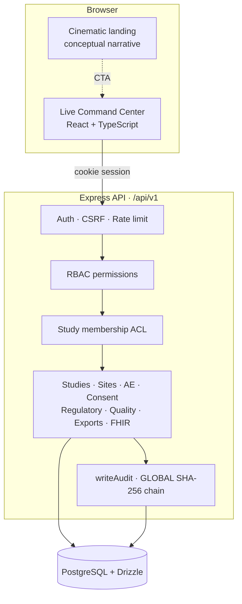
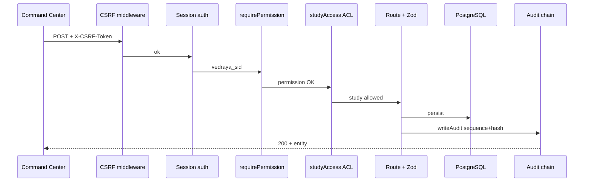
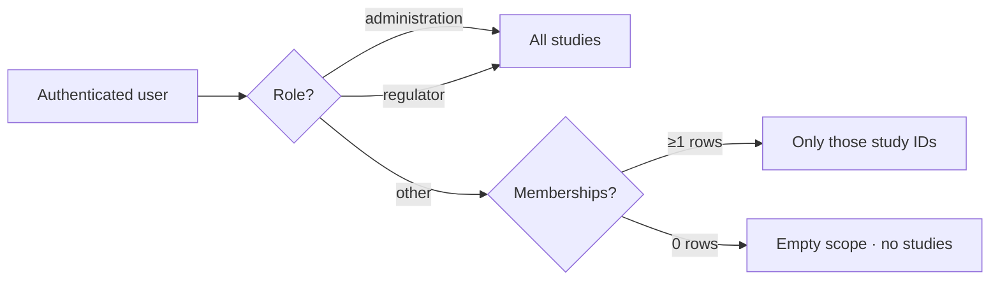
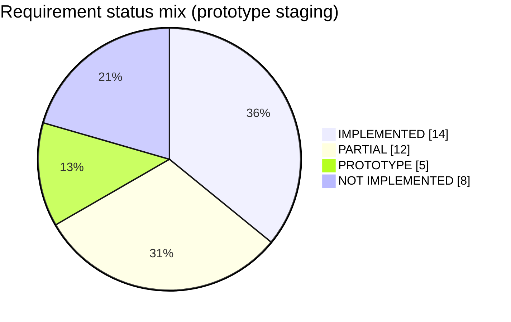
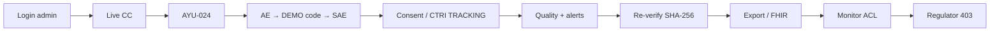

# VEDRAYA

**Clinical Research Intelligence · SIH26046 CTMS Prototype**

> All India Institute of Ayurveda (AIIA) · Ministry of Ayush  
> Real-time, role-based Clinical Trial Management System prototype with pharmacovigilance, ethics/CTRI tracking, and an append-only audit hash-chain.

[](./docs/SIH26046_TRACEABILITY_FINAL.md)
[](#architecture)
[](./docs/DEMO_SCRIPT.md)
[](./docs/LIMITATIONS.md)

The cinematic landing (GSAP · Lenis · theme) is preserved.  
The **Live Command Center** is the source of truth — PostgreSQL-backed CTMS operations.

```text
npm run demo:seed   →   open Live Command Center   →   admin@vedraya.demo / Vedraya!Demo1
```

---

## What VEDRAYA is (and is not)

| Is | Is not |
|----|--------|
| Working CTMS prototype for SIH judges | Production / certified CTMS |
| Auth · RBAC · study ACL · audit chain | WORM / legal ALCOA+ attestation |
| MedDRA / WHODrug **compatible DEMO** coding | Licensed MedDRA / WHODrug |
| SDTM-like AE + FHIR R4 **prototype** | CDISC certified / ABDM connected |
| CTRI / NDCT **TRACKING** | External CTRI API integration |

Full honesty: [`docs/LIMITATIONS.md`](./docs/LIMITATIONS.md) · Judge answers: [`docs/JUDGE_QA.md`](./docs/JUDGE_QA.md)

---

## Architecture



### Request path (mutations)



### Study ACL model



---

## SIH26046 coverage (summary)



Exact PS matrix: [`docs/SIH26046_TRACEABILITY_FINAL.md`](./docs/SIH26046_TRACEABILITY_FINAL.md)

| Domain | Status |
|--------|--------|
| Portfolio · KPIs · alerts | Implemented (DB-derived) |
| Studies / sites / investigators / participants | Implemented |
| AE/SAE · reporting timeline · coding DEMO | Partial / prototype |
| Consent · ethics · CTRI/NDCT tracking | Partial |
| Protocol deviations · data queries | Partial |
| Audit GLOBAL SHA-256 verify | Implemented (app-level) |
| FHIR R4 ResearchStudy/Subject | Prototype |
| ABDM / HIS / EDC | **NOT CONNECTED** |
| Full CDISC / Define-XML / eSign / WORM | Not implemented |

---

## Stack

| Layer | Technology |
|-------|------------|
| Frontend | React 19 · TypeScript · Vite · GSAP · Lenis |
| Backend | Node.js · Express · Zod |
| Database | PostgreSQL · Drizzle ORM |
| Auth | HTTP-only cookie `vedraya_sid` · Argon2id · CSRF double-submit |
| Tests | Vitest (API) · Playwright (E2E) |

---

## Quick start

### 1. PostgreSQL

```bash
docker run --name vedraya-pg \
  -e POSTGRES_PASSWORD=vedraya \
  -e POSTGRES_USER=vedraya \
  -e POSTGRES_DB=vedraya \
  -p 55432:5432 -d postgres:16
```

### 2. API

```bash
cd server
cp .env.example .env   # set DATABASE_URL + SESSION_SECRET
npm install
npm run db:setup       # migrate + deterministic demo seed
npm run dev            # http://127.0.0.1:4000
```

### 3. Frontend

```bash
# repo root
npm install
npm run dev            # http://localhost:3000  (proxies /api → :4000)
```

### Demo freeze (before judges)

```bash
npm run demo:seed
```

Clears E2E pollution and restores AYU-024 portfolio.

---

## Demo credentials

**Password (all accounts):** `Vedraya!Demo1`  
Synthetic data only — no real patient information.

| Email | Role | Study scope |
|-------|------|-------------|
| `admin@vedraya.demo` | Administration | All |
| `regulator@vedraya.demo` | Regulator (read) | All (writes → 403) |
| `pi@vedraya.demo` | Principal Investigator | AYU-024, AYU-031 |
| `coord@vedraya.demo` | Study Coordinator | AYU-024, AYU-031, AYU-018 |
| `monitor@vedraya.demo` | Monitor | **AYU-024 only** |
| `pv@vedraya.demo` | Pharmacovigilance | AYU-024, AYU-031, AYU-018 |
| `ethics@vedraya.demo` | Ethics Committee | AYU-024, AYU-031 |

---

## Judge flow (3–5 min)



Timed script: [`docs/DEMO_SCRIPT.md`](./docs/DEMO_SCRIPT.md)

---

## API surface

Base: `/api/v1` · Cookie session · CSRF header on mutations

| Area | Paths |
|------|-------|
| Auth | `/auth/login` · `/logout` · `/me` |
| Studies | CRUD · KPIs · archive · ACL |
| Ops | sites · investigators · participants · milestones |
| Safety | adverse-events · coding · notify-authority |
| Quality | `/quality/deviations` · `/quality/queries` |
| Compliance | consents · regulatory (IEC / CTRI / NDCT) |
| Integrity | `/audit-events` · `/audit-events/verify` |
| Interop | `/fhir/R4/...` · `/interop/adapters` |
| Export | CSV · `/exports/sdtm/ae` (prototype) |

Details: [`docs/API.md`](./docs/API.md)

---

## Tests & quality

```bash
cd server && npm test          # Vitest ≥ 46
npm run test:e2e               # Playwright ≥ 26 (repo root)
npm run build                  # frontend production build
```

---

## Documentation map

| Doc | Purpose |
|-----|---------|
| [`SIH26046_TRACEABILITY_FINAL.md`](./docs/SIH26046_TRACEABILITY_FINAL.md) | Exact PS requirement matrix |
| [`IMPLEMENTATION_STATUS.md`](./docs/IMPLEMENTATION_STATUS.md) | Honest status table |
| [`LIMITATIONS.md`](./docs/LIMITATIONS.md) | Non-claims |
| [`DEMO_SCRIPT.md`](./docs/DEMO_SCRIPT.md) | 3–5 min judge script |
| [`JUDGE_QA.md`](./docs/JUDGE_QA.md) | Prepared answers |
| [`RBAC.md`](./docs/RBAC.md) · [`SECURITY.md`](./docs/SECURITY.md) · [`AUDIT.md`](./docs/AUDIT.md) | Access · security · hash-chain |

---

## Deploy notes

| Surface | Hosting |
|---------|---------|
| Frontend (Vite SPA) | Vercel |
| API + PostgreSQL | Run `server/` + managed Postgres (API is not serverless on Vercel by default) |

Local full stack remains the primary SIH demo path (`npm run demo:seed` + both processes).

---

## License / context

Built for **Smart India Hackathon** problem statement **26046** (Ministry of Ayush / AIIA).  
Prototype software — not a medical device; not a regulatory filing system.
